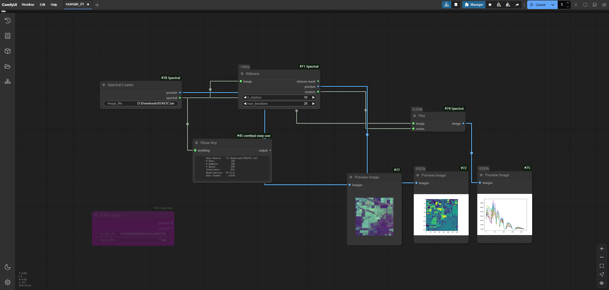

# ComfyUI Spectral

`ComfyUI Spectral` is a ComfyUI custom nodes library based on the [spectral](https://github.com/spectralpython/spectral), 
mainly used for visual processing of spectral files

## Install

You can choose to install it using [ComfyUI Manager](https://github.com/ltdrdata/ComfyUI-Manager)

Or manual installation:

1. clone to your `custom_nodes` folder
2. `cd ComfyUI_Spectral`
3. install dependencies `pip install -r reqirements.txt`
4. restart ComfyUI

## Notice

**_This repository is in the early stages of development, the functionality is not complete and may change in the future_**

## Workflow

### Load & Preview

download workflow: [example_01](./workflows/example_01.json)

### K-Means

download workflow: [example_01](./workflows/example_02.json)

## Nodes

- `Spectral Loader`: load spectral file, output `Spectral` object and preview image
- `ENVI Loader`: load imagery with associated ENVI header files and reading & writing spectral libraries with ENVI headers. 

## WIP

- ~~plot node~~
- ~~k-means node~~
- ~~calculate nodes~~
- pca node
- save node
- preprocess nodes
- improve performance
